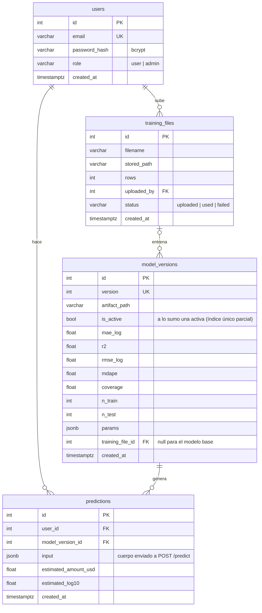

# Diagrama entidad-relación

Generado a partir de `alembic/versions/0001_initial_schema.py`. GitHub renderiza el bloque mermaid.

```mermaid
erDiagram
    users ||--o{ predictions : "hace"
    users ||--o{ training_files : "sube"
    model_versions ||--o{ predictions : "genera"
    training_files |o--o{ model_versions : "entrena"

    users {
        int id PK
        varchar email UK
        varchar password_hash "bcrypt"
        varchar role "user | admin"
        timestamptz created_at
    }
    training_files {
        int id PK
        varchar filename
        varchar stored_path
        int rows
        int uploaded_by FK
        varchar status "uploaded | used | failed"
        timestamptz created_at
    }
    model_versions {
        int id PK
        int version UK
        varchar artifact_path
        bool is_active "a lo sumo una activa (índice único parcial)"
        float mae_log
        float r2
        float rmse_log
        float mdape
        float coverage
        int n_train
        int n_test
        jsonb params
        int training_file_id FK "null para el modelo base"
        timestamptz created_at
    }
    predictions {
        int id PK
        int user_id FK
        int model_version_id FK
        jsonb input "cuerpo enviado a POST /predict"
        float estimated_amount_usd
        float estimated_log10
        timestamptz created_at
    }
```
